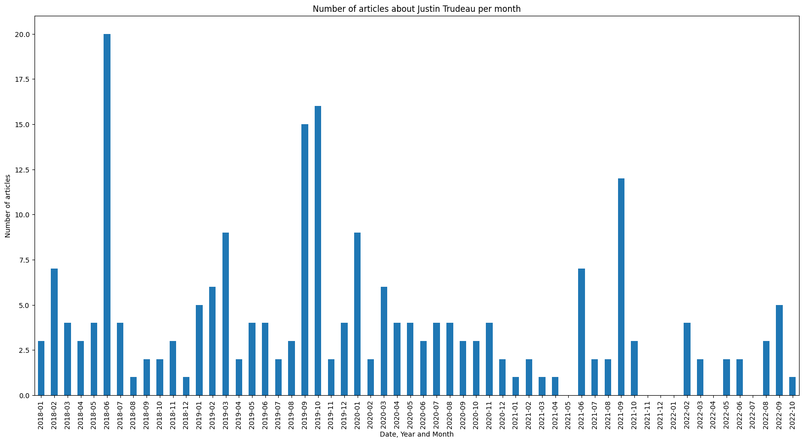

# Justin articles
## Description
Load statistics of articles about Justin Trudeau from the Guardian Media Group API [documentation](http://open-platform.theguardian.com/documentation/). 

Created 2 files:
1. `number of articles about Justin Trudeau.csv` contains numbers of articles per day about Justin Trudeau in the next format:
```
    „Date“ and „No. of articles“
    2018-01-01 3
    2018-01-02 4
    2018-01-03 2
```
2. `Number of articles about Justin Trudeau per month.png` barchart graph with number of articles per month.


## Running the app

### 1. Get the API key.
 Needed to [sign up for an API key](https://open-platform.theguardian.com/access/) and save this key to `api.cfg` (use `api_ex.cfg` as reference).
 
 ### 2. Install python and required libraries. 

To install python use the next link [Download python ](https://www.python.org/downloads/).

The following command will install the packages according to the configuration file `requirements.txt`.
`$ pip install -r requirements.txt`

 ### 3. Run app.
 The following command runs the app.
 `$ python main.py`