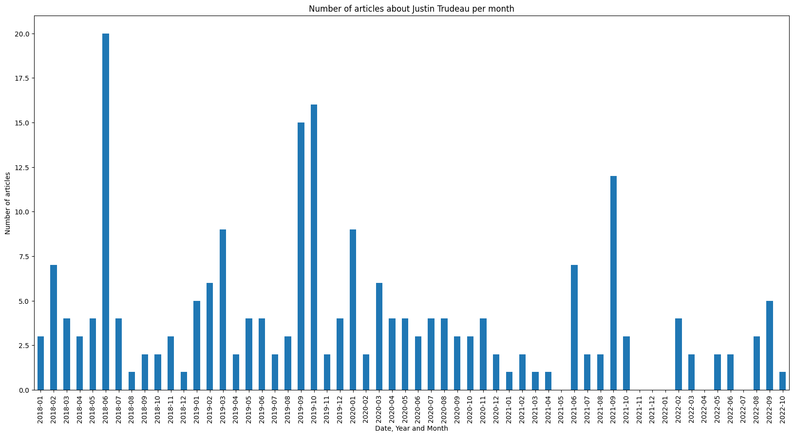

# Justin articles
## Description
This utility loads statistics of articles about Justin Trudeau from the Guardian Media Group API ([documentation](http://open-platform.theguardian.com/documentation/)).
It creates 2 files:
1. `number_of_articles_about_justin_trudeau.csv` contains numbers of articles per day about Justin Trudeau in the following format:
```
    „Date“ and „No. of articles“
    2018-01-01 3
    2018-01-02 4
    2018-01-03 2
```
2. `number_of_articles_about_justin_trudeau_per_month.png` barchart graph with number of articles per month:


These files are refreshed by app everyday at 00:00.

## Running the app

### 1. Get the API key.
 It is needed to [sign up for an API key](https://open-platform.theguardian.com/access/) and save this key to `api.cfg` (use `api_ex.cfg` as reference).
 
 ### 2. Install python and required libraries. 

To install python use the next link [Download python ](https://www.python.org/downloads/).

The following command will install the packages according to the configuration file `requirements.txt`:
`$ pip install -r requirements.txt`

 ### 3. Run app.
 The following command runs the app:
 `$ python main.py`
